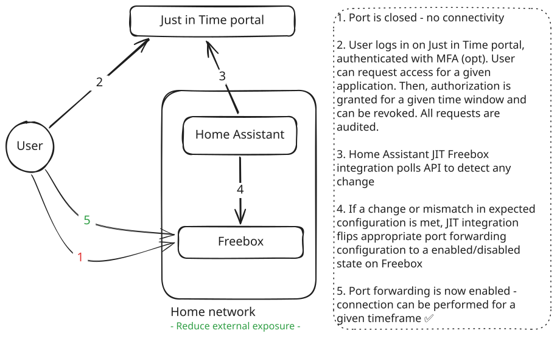

# Just-In-Time Freebox (HACS)

A Home Assistant custom integration that polls an external "grants" API and, when a grant is active, **enables a matching port-forwarding rule on your local Freebox**. When the grant expires (or is revoked), the rule is automatically disabled.

## How it works

Each poll, the integration calls your grants API. The expected JSON response is:

```json
{
  "granted": true,
  "port": 1194,
  "protocol": "udp",
  "startedUtc": "2026-05-09T05:16:14.7766561+00:00",
  "expiresUtc": "2026-05-09T13:16:14.7766561+00:00",
  "remainingSeconds": 26641
}
```

When `granted` is `true` and not expired, the integration looks for an existing Freebox port-forwarding rule (`fw/redir/`) whose `lan_port` and `ip_proto` match `port` and `protocol`. If found, the rule's `enabled` flag is set to `true`. When `expiresUtc` is reached or `granted` flips to `false`, the rule is set back to `enabled: false`.

On **every poll** the integration reconciles the rule's state, so any out-of-band toggle (manual edit, restart, etc.) is corrected on the next tick.

The integration **never creates or deletes Freebox rules** — it only toggles existing ones. If no matching rule exists, the `last_action` sensor reports `rule_not_found` and the grant is otherwise ignored.

<picture>
  <source media="(prefers-color-scheme: dark)"  srcset="docs/jit-freebox-dark.svg">
  <source media="(prefers-color-scheme: light)" srcset="docs/jit-freebox-light.svg">
  
</picture>

## Installation (HACS)

1. In HACS, add this repository as a custom repository (category: *Integration*).
2. Install **Just-In-Time Freebox** from HACS.
3. Restart Home Assistant.
4. Settings → Devices & services → Add integration → *Just-In-Time Freebox*.

> **Upgrading from 0.1.x:** version 0.2.0 switches to the official `freebox-api` library. Remove the existing integration entry and re-add it after upgrading (a fresh pairing is required).

## Configuration

The setup form asks for:

- **Grants API URL** — full URL of your grants endpoint.
- **Grants API key** — sent as `X-Access-Key: <key>`.
- **Freebox host** — e.g. `mafreebox.freebox.fr` (default) or your LAN IP.
- **Poll interval (seconds)** — minimum 5, default 30.

After submitting, you will be prompted to **press the right arrow (▶) on the Freebox front panel** to authorize Home Assistant. The resulting `app_token` is stored under `<config>/just_in_time_freebox/<host>.conf` (managed by the `freebox-api` library).

TLS to the Freebox is handled by the library, which bundles the Freebox CA — no HTTPS toggle is needed.

Grants URL, grants key and poll interval can be edited later via *Configure* on the integration card. Changing the Freebox host requires removing and re-adding the integration.

## Required Freebox permissions

The Freebox API does **not** allow an app to request specific permissions during pairing — a fresh `app_token` starts with the default (minimal) permission set. You must grant the **Modification des réglages de la Freebox** (`settings`) permission to this integration manually, otherwise every Freebox call will fail with HTTP 403 `insufficient_rights` and entities will report `freebox_error`.

Steps (one-time, after pairing):

1. Open **Freebox OS** as administrator (`http://mafreebox.freebox.fr/`).
2. Go to **Paramètres de la Freebox → Mode avancé → Gestion des accès → Applications**.
3. Find the row named **JIT Freebox** (the `app_name` declared by this integration).
4. Tick **Modification des réglages de la Freebox**, then save.
5. In Home Assistant, reload the integration (or wait for the next poll).

> If the admin password is later reset on the Freebox, **all app permissions are reset to defaults** and you will need to redo step 4.

## Entities

A single device is created with:

- `binary_sensor.*_granted` — current grant state (`connectivity` device class).
- `sensor.*_status` — `granted` / `not_granted` / `unknown`.
- `sensor.*_port` — current port.
- `sensor.*_protocol` — `tcp` / `udp`.
- `sensor.*_expires_at` — timestamp.
- `sensor.*_remaining` — duration in seconds.
- `sensor.*_last_action` — diagnostic: `idle`, `enabled_rule`, `disabled_rule`, `rule_not_found`, `freebox_error`.

## Resilience

If the Freebox is unreachable, the integration applies **exponential backoff** to its Freebox calls (base = poll interval, capped at 15 minutes), resetting on the next successful call. Grants API failures mark entities unavailable until the next successful poll.

## Troubleshooting

- **`rule_not_found`** — create the matching redirection on the Freebox first (Freebox OS → Paramètres de la Freebox → Gestion des ports), matching the grant's `port` (as `lan_port`) and `protocol`. The integration will only flip its `enabled` flag.
- **Pairing fails** — confirm the Freebox host is reachable and that you pressed the front-panel button.
- **`freebox_connection_error`** — verify `http://<host>/api_version` is reachable from Home Assistant; the integration uses it to discover the API endpoint.
- Enable debug logs via `logger:` → `custom_components.just_in_time_freebox: debug` (and `freebox_api: debug`) to inspect requests.
